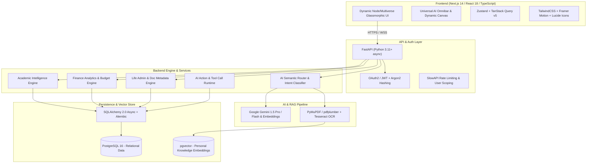

# WEBVERSE — Comprehensive System Architecture & Engineering Plan
**Tagline:** *"Your Life. One Connected Intelligence."*

---

## 1. Executive Summary & Specification Analysis

**WEBVERSE** is designed as a unified personal intelligence OS centered around three core modules:
1. **StudentOS / Academics** (Subjects, attendance tracking, marks, timetable, assignments, exams, notes)
2. **AI Money Manager** (Income, expenses, budgets, category analysis, subscription tracking, cash flow forecasting)
3. **Life Admin** (Document repository, insurance, identity docs, recurring bills, warranties, reminders, appointments)

Connecting these three domains is a **Universal AI Layer** executing:
`Intent Classification -> Dynamic Multi-Module Retrieval -> Deterministic Tool/Query Execution -> Personal Knowledge RAG -> Cross-Module Reasoning -> Verified Action Execution`.

---

## 2. Technical Architecture & Tech Stack Justification

### Architecture Overview



### Technology Selections & Rationale:

| Layer | Technology | Rationale |
|---|---|---|
| **Frontend Framework** | **Next.js 14 (App Router) + TypeScript** | High-performance rendering, strong type-safety matching backend schemas, and modern component architecture. |
| **Styling & Motion** | **Tailwind CSS + Framer Motion + Lucide Icons** | Custom obsidian/cyber-multiverse design tokens, glassmorphism, node graph visualizations, and smooth dimensional transitions. |
| **Backend Engine** | **FastAPI (Python 3.11+)** | Asynchronous I/O, native Pydantic v2 validation, automatic OpenAPI specs, and rich Python AI/data science libraries. |
| **Database & Vector Store** | **PostgreSQL 16 + pgvector** | Unified relational and vector database. Guarantees transactional ACID guarantees and eliminates sync issues between relational data and vector stores. |
| **ORM & Migrations** | **SQLAlchemy 2.0 (AsyncIO) + Alembic** | High-performance async connection pooling via `asyncpg`, robust migrations, and relationship management. |
| **Document Processing** | **PyMuPDF + Tesseract OCR** | Rapid text extraction from PDFs with OCR fallback for scanned images and paper bills. |
| **AI LLM & Embeddings** | **Google Gemini 1.5 Pro / Flash + `text-embedding-004`** | Large context capacity, ultra-fast structured JSON routing, native function calling, and high cost-efficiency. |

---

## 3. Directory Structure

```
WEBVERSE/
├── backend/
│   ├── app/
│   │   ├── api/
│   │   │   ├── v1/
│   │   │   │   ├── auth.py              # Register, login, refresh, profile
│   │   │   │   ├── academics.py         # Subjects, attendance, marks, timetable, assignments
│   │   │   │   ├── finance.py           # Expenses, income, budgets, transactions, analytics
│   │   │   │   ├── life_admin.py        # Documents, reminders, bills, subscriptions, insurance
│   │   │   │   ├── ai_chat.py           # Universal chat, streaming endpoints, session history
│   │   │   │   ├── rag.py               # Document upload, chunking, indexing, semantic query
│   │   │   │   ├── ai_actions.py        # Validated AI tool execution & confirmation
│   │   │   │   └── dashboard.py         # Aggregated multiverse glance metrics
│   │   │   └── router.py                # Aggregated API router
│   │   ├── core/
│   │   │   ├── config.py                # Pydantic BaseSettings (env vars, secrets, AI keys)
│   │   │   ├── database.py              # Async engine, session factory, pgvector init
│   │   │   ├── security.py              # Passlib bcrypt/argon2, JWT encoder/decoder
│   │   │   └── exceptions.py            # Custom HTTP exceptions and error handlers
│   │   ├── models/                      # SQLAlchemy ORM declarative models
│   │   │   ├── base.py                  # Base model with UUID, created_at, updated_at
│   │   │   ├── user.py                  # User, UserProfile, UserSettings
│   │   │   ├── academic.py              # Subject, AttendanceLog, TimetableSlot, Assignment, Exam, Note
│   │   │   ├── finance.py               # ExpenseCategory, Transaction, Budget, Subscription
│   │   │   ├── life_admin.py            # Document, DocMetadata, Reminder, Appointment
│   │   │   ├── ai.py                    # ConversationSession, ChatMessage, MessageSourceReference
│   │   │   └── vector_embeddings.py     # DocumentChunk (pgvector embedding model)
│   │   ├── schemas/                     # Pydantic request & response DTOs
│   │   ├── services/                    # Deterministic business logic & calculation services
│   │   ├── ai_engine/                   # Semantic router, retrievers, RAG, tool action handlers
│   │   └── utils/                       # Helpers (date, math, logger)
│   ├── alembic/                         # Database migration scripts
│   ├── uploads/                         # Secure user document storage
│   ├── tests/                           # Pytest suite
│   ├── requirements.txt
│   └── main.py                          # FastAPI ASGI entrypoint
│
├── frontend/
│   ├── src/
│   │   ├── app/                         # Next.js App Router
│   │   │   ├── (auth)/login & register
│   │   │   ├── (dashboard)/
│   │   │   │   ├── page.tsx             # Overview Matrix (Glance Dashboard)
│   │   │   │   ├── academics/page.tsx   # Attendance tracker, timetable, subjects
│   │   │   │   ├── finance/page.tsx     # Spend tracker, budget meters, analytics
│   │   │   │   ├── life-admin/page.tsx  # Document vault, insurance, reminders
│   │   │   │   └── chat/page.tsx        # Dedicated Universal AI workspace
│   │   ├── components/
│   │   │   ├── ui/                      # Glassmorphic primitives (Card, Modal, Button, Badge)
│   │   │   ├── layout/                  # Navbar, Sidebar, Omnibar, Multiverse Canvas
│   │   │   ├── academics/               # AttendanceCard, TimetableGrid, AssignmentList
│   │   │   ├── finance/                 # BudgetProgressBar, ExpensePieChart, CategoryTrend
│   │   │   └── life-admin/              # DocumentUploadZone, ReminderCard
│   │   ├── hooks/                       # Custom hooks (useChat, useAcademics, useFinance)
│   │   ├── store/                       # Zustand state stores
│   │   └── styles/globals.css           # Multiverse Cyber-Dark theme tokens
│   ├── package.json
│   └── tailwind.config.ts
└── README.md
```

---

## 4. Relational & Vector Database Design

- **Multi-tenancy Guarantee:** Every table has a non-nullable `user_id` foreign key referencing `users(id)` with cascading deletes and composite indexing on `(user_id, date)` or `(user_id, created_at)`.
- **Structured Domains:**
  - `users`, `user_profiles`
  - `subjects`, `attendance_records` (PRESENT, ABSENT, CANCELLED, DUTY_LEAVE), `timetable_slots`, `assignments`, `exams`, `academic_notes`
  - `expense_categories`, `transactions` (INCOME, EXPENSE), `budgets`, `subscriptions`
  - `documents`, `document_metadata` (JSONB for dynamic key-values), `document_chunks` (`embedding vector(768)`), `reminders`
  - `conversation_sessions`, `chat_messages` (with JSONB `source_references` and `proposed_action`)

---

## 5. Universal AI Router & RAG Pipeline

1. **User Query Received:** e.g., *"Can I afford to go to the weekend trip given my upcoming exams and bills?"*
2. **Intent Classification & Entity Routing (Semantic Router):**
   - Identifies active domains: `[FINANCE, ACADEMICS, LIFE_ADMIN]`
3. **Deterministic Multi-Source Fetching:**
   - **Academic Service:** Fetches exam dates and assignment deadlines for the next 7 days.
   - **Finance Service:** Calculates available liquid balance, remaining monthly budget, and burn rate.
   - **Life Admin Service:** Checks upcoming utility bills, subscriptions, and reminders due this week.
   - **Personal RAG (pgvector):** Performs cosine similarity search over personal notes/documents if query references specific study material or policies.
4. **Context Synthesis & Grounded Prompting:** Assembles clean, factual JSON context and injects it into Gemini 1.5 with the system persona.
5. **Streamed Response & Citation:** Returns structured natural language response with visual citations indicating which modules contributed to the answer.
6. **AI Action Confirmation:** When an action is detected (e.g., *"Add ₹250 for lunch"*), the engine returns an interactive proposal requiring explicit user confirmation before executing.

---

## 6. Frontend UI / UX & Visual Metaphor

- **Aesthetic:** Dark Multiverse / Cyber-Glassmorphic interface inspired by digital nodes and connected dimensions.
- **Color Codes:**
  - Background: Obsidian Space (`#080B11`, `#0F172A`)
  - Academics: Electric Violet (`#8B5CF6`)
  - Finance: Cyber Emerald / Cyan (`#10B981` / `#06B6D4`)
  - Life Admin: Quantum Amber (`#F59E0B`)
  - AI Nexus: Neon Hyper-Pink & Indigo (`#EC4899` / `#6366F1`)
- **Key Elements:**
  - **Universal Omnibar:** Centered floating command palette (`Ctrl + K`) with live domain badge toggles.
  - **Multiverse Glance Matrix:** 3-quadrant dashboard showing critical numbers (Attendance %, Safe Bunks, Remaining Budget, Urgent Reminders) without clutter.
  - **Node Canvas Background:** Subtle interactive web lines connecting dimension nodes.

---

## 7. Phased Development Roadmap

- **Phase 1: Foundation & Infrastructure** (Monorepo setup, FastAPI async + PostgreSQL + pgvector, Next.js 14 setup, JWT Auth, Base UI Tokens)
- **Phase 2: Academic Intelligence Module** (Subject CRUD, attendance logging & safe bunk calculation engine, timetable & assignment tracker)
- **Phase 3: AI Money Manager Module** (Expense/income logging, budget limits, category analytics, subscription tracker)
- **Phase 4: Life Admin Module** (Document vault, PDF text parsing/OCR, metadata extraction, reminders & important dates)
- **Phase 5: Universal AI Router & RAG Integration** (Intent classification, multi-module retrieval, Gemini API, pgvector semantic search)
- **Phase 6: Cross-Module Intelligence & AI Actions** (Cross-domain queries, safe AI tool execution loop)
- **Phase 7: Visual Polish, Animations, Testing & E2E Validation** (Node canvas, responsive tuning, unit/integration tests)
